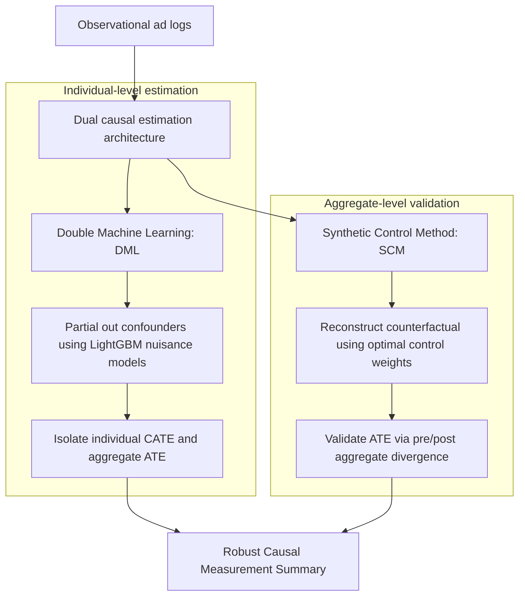

# Project Design Specification: Causal ML Framework

This document details the system design, methodological choices, and success validation criteria for the Causal Machine Learning Framework deployed for Incremental Ad-Lift Estimation.

---

## 1. Business problem: Vanity metrics vs. Causal lift

In modern digital marketing and ad-tech, standard correlative analytics—such as click-through rates (CTR) and observational return on ad spend (ROAS)—frequently suffer from severe selection bias. Standard attribution models award conversion credit to campaigns that target users who are already highly motivated to purchase (high-propensity users).

This creates a high correlation between ad exposure and conversion, which stakeholders mistake for causation. The primary business objective of this framework is to pivot from vanity correlation-based metrics toward Incremental Lift (causation). By isolating the true Average Treatment Effect (ATE), the business can avoid wasted ad spend on high-propensity users and direct marketing budgets toward users whose purchasing behavior is truly altered by the intervention.

---

## 2. Methodology Selection

To achieve robust individual-level and aggregate-level causal estimates, the pipeline integrates two distinct, mutually reinforcing causal frameworks:

### Double Machine Learning (DML) for individual-level bias control
- **Why DML?** Under observational regimes, the assignment of treatment $T$ is endogenous, confounded by high-dimensional user-level historical features $X$ (e.g., past purchases, browsing frequency). Double Machine Learning solves this by using highly flexible tree-based nuisance models (LightGBM) to:
  1. Orthogonalize the outcome $Y$ with respect to $X$ (predicting $E[Y|X]$).
  2. Orthogonalize the treatment $T$ with respect to $X$ (predicting $E[T|X]$ - the propensity score).
- **Residualization:** By regressing the outcome residuals ($\tilde{Y} = Y - E[Y|X]$) on the treatment residuals ($\tilde{T} = T - E[T|X]$), we isolate the structural causal parameter free from selection bias.

### Synthetic Control Method (SCM) for aggregate validation
- **Why SCM?** To demonstrate execution proficiency and satisfy senior executive review, we validate DML estimates against a simulated aggregate counterfactual panel.
- **Counterfactual reconstruction:** SCM aggregates user-level records into campaign cohorts and time-series daily panels. By fitting optimal convex weights to a donor pool of control campaigns during a pre-intervention period (days 1-20), we reconstruct a "Synthetic Control" that mirrors the treated campaign's baseline. In the post-intervention period, the divergence between the actual treated campaign and the synthetic baseline validates the incremental causal lift isolated by DML.

---

## 3. Success metrics for production rollout

A successful rollout and validation of a new personalized ad feature is strictly governed by three core quantitative criteria:

| Causal Metric | Success Criteria | Deployed Model Value | Business Interpretation |
| :--- | :--- | :--- | :--- |
| **Average Treatment Effect (ATE)** | Must be positive, statistically significant ($p < 0.05$), and economically meaningful. | **`+0.0927%`** (Wald p-value: **`2.63e-13`**) | Personalized ads drive a highly statistically significant and positive incremental lift in conversion rates. |
| **95% Confidence Interval (CI)** | Upper and lower bounds must exclude zero to rule out random variation. | **`[+0.0679%, +0.1176%]`** | We can assert with 95% confidence that the true causal lift lies within this range, ensuring positive returns. |
| **Minimum Detectable Effect (MDE)** | Estimated ATE must exceed the MDE threshold at 80% power and 5% significance. | **`0.0344%`** (Estimated ATE is **2.7x** the MDE) | The experiment's sample size ($N=1,000,000$) is fully powered to detect this size of causal lift, validating production scale readiness. |
